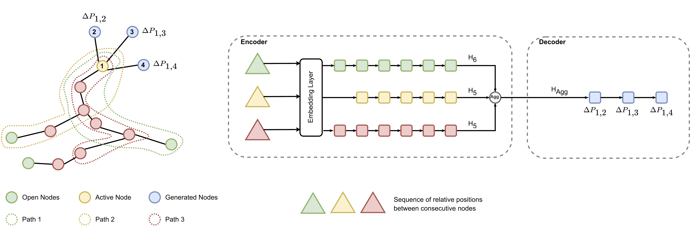

# Vascular Network Synthesizer

Vascular Network Synthesizer (VNS) is a PyTorch tool for the generation of synthetic vascular networks. In a more general sense, 
the framework can be applied to the generation of any kind of spatial graph networks. The proposed approach looks to
graph construction as an iterative process, where the building procedure occurs by adding nodes and edges to the existing graph.
Figures 1 shows a general overview of the process, in specific, how a set o random paths starting from a given node
are used to predict the next ones.



**Note: ** Please note that this is a work in progress. The code is not yet fully documented, no tests have been written
and the code is not yet fully optimized. However, the code is functional and can be used to train a model and generate
vascular structures.

## Installation

The application uses Poetry to manage dependencies. To install Poetry, please follow the instructions on the official website:
https://python-poetry.org/docs/#installation. The application has been tested with Python 3.10. After installing Poetry,
please run `poetry install` to install the dependencies. Now you can run the application using 
`poetry run python train.py` with the following environment variables: ```WANDB_API_KEY=<your_wandb_api_key>```. For now,
a WandB account is required to run the application, where the results will be logged.

If you prefer, a Dockerfile is also provided. You can build the image and run the ```main.py``` script inside
the container. More details on how to run will be provided in the future.
